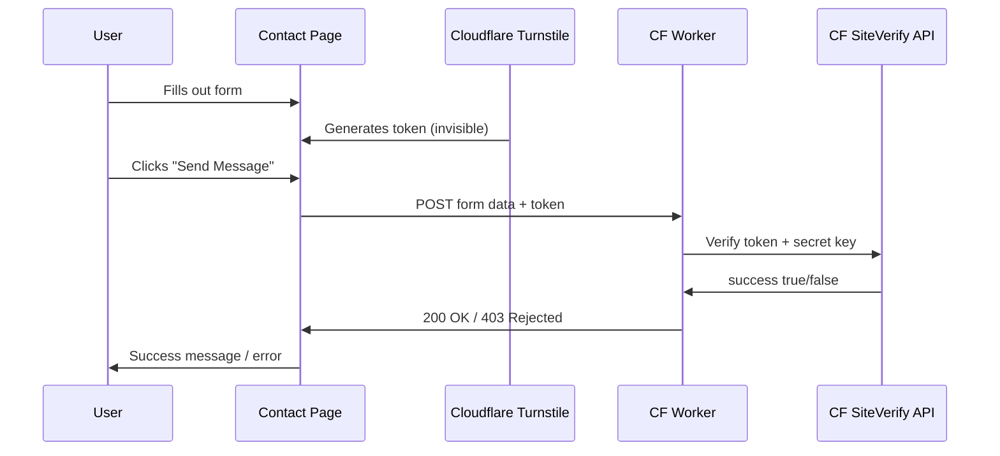

# Cloudflare Turnstile + Worker Verification Plan

**Status:** Implemented (pending deployment — see Deployment Steps below)

## Overview

Replace the math CAPTCHA on the contact form with Cloudflare Turnstile, and create a Cloudflare Worker to verify tokens server-side. Email delivery will be added later.

## Flow

## Changes Required

### 1. Update contact form (`src/pages/contact.astro`)

- Remove the math CAPTCHA (question input, honeypot, and validation script)
- Add Cloudflare Turnstile script tag and widget `
`
- Replace `action="#"` with the Worker URL (placeholder until deployed)
- Add JS to submit the form via `fetch()` to the Worker, passing the Turnstile token
- Show success/error feedback inline after submission
- Use a placeholder site key (`REPLACE_WITH_YOUR_SITE_KEY`) that you'll swap with your real key from Cloudflare dashboard

### 2. Create Cloudflare Worker (`worker/index.js`)

A small script (~40 lines) that:

- Receives POST with form fields + `cf-turnstile-response` token
- Verifies the token against `https://challenges.cloudflare.com/turnstile/v0/siteverify` using your secret key (stored as a Worker secret, never in code)
- Returns 200 if verified, 403 if not
- Logs the submission data (name, email, subject, message) — ready for email delivery to be wired in later
- Includes CORS headers so the form can submit from your site

### 3. Deployment Steps

1. **Get Turnstile keys:** Cloudflare Dashboard > Turnstile > Add Widget > copy Site Key + Secret Key
2. **Deploy Worker:** Install Wrangler CLI (`npm i -g wrangler`), login, deploy with `wrangler deploy`
3. **Set Worker secret:** `wrangler secret put TURNSTILE_SECRET_KEY` (paste your secret key)
4. **Update site key:** Replace placeholder in `contact.astro` with your real site key
5. **Update Worker URL:** Replace placeholder in `contact.astro` with your deployed Worker URL

## Test Keys (for development)

Cloudflare provides test keys that work without a real account:

- **Always passes:** Site key `1x00000000000000000000AA`, Secret key `1x0000000000000000000000000000000AA`
- **Always fails:** Site key `2x00000000000000000000AB`, Secret key `2x0000000000000000000000000000000AB`

## Security Notes

- Tokens are cryptographically signed by Cloudflare and cannot be forged
- Server-side verification is required for real security (client-side only is cosmetic)
- Tokens are single-use and expire after 5 minutes
- The secret key is stored as a Worker secret, never committed to code
- Cloudflare Workers free tier: 100,000 requests/day (more than enough)
- Cloudflare Turnstile is completely free with no usage limits
